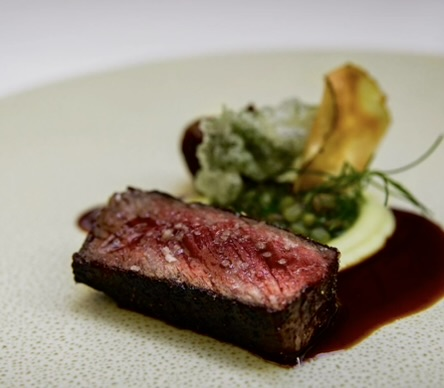

# Automatic Signature Dishes Setup - Complete! ✅

## What Changed

Your Chef Profile website now has **automatic image loading** for the Signature Dishes section. No more manually editing HTML!

### Files Modified:
1. **index.html** - Removed hardcoded gallery items, replaced with a single container that gets populated automatically
2. **js/app.js** - Added dynamic image loading using webpack's `require.context()`
3. **webpack.config.prod.js** - Added configuration to copy the signature-dishes folder during build

### New Folder Created:
- **img/signature-dishes/** - This is where you put your dish images

## How to Use

### 1. Add Images
Place your dish images in: `img/signature-dishes/`

**Supported formats:**
- jpg
- jpeg
- png
- gif
- webp

### 2. Rebuild the Site

For **development** (with hot reload):
```bash
npm start
```

For **production** build:
```bash
npm run build
```

### 3. Done!
Images will automatically appear in the Signature Dishes gallery section in alphabetical order by filename.

## Example

**Before:** You had to manually add this to index.html:
```html
<figure class="gallery-item">
  
</figure>
```

**Now:** Just save `Seared_steak.jpg` to `img/signature-dishes/` and run `npm start` - done! ✨

## Features

✅ **Automatic** - No HTML editing needed
✅ **Lazy Loading** - Images load as needed for better performance
✅ **Alphabetical Order** - Images display sorted by filename
✅ **Auto Alt Text** - Alt text is generated from filename
✅ **Responsive** - Gallery maintains existing CSS styling
✅ **Build Compatible** - Works with both dev and production builds

## Tips for Best Results

1. **Name your files descriptively:**
   - ✅ Good: `pan_seared_salmon.jpg`, `chocolate_mousse.png`
   - ❌ Bad: `IMG_123.jpg`, `photo.jpg`

2. **Image naming affects alt text:**
   - File: `pan_seared_salmon.jpg`
   - Auto alt text: "Chef Christian's signature dish - pan_seared_salmon"

3. **Clean up old code:**
   - All the hardcoded image references in the old gallery have been removed
   - The old images in `img/` folder won't display unless moved to `img/signature-dishes/`

## No Backend Required

Everything works **client-side** with webpack - no server-side code needed! Just:
1. Add images to the folder
2. Rebuild
3. Deploy

---

**That's it! Your dish gallery is now fully automated.** 🍽️

